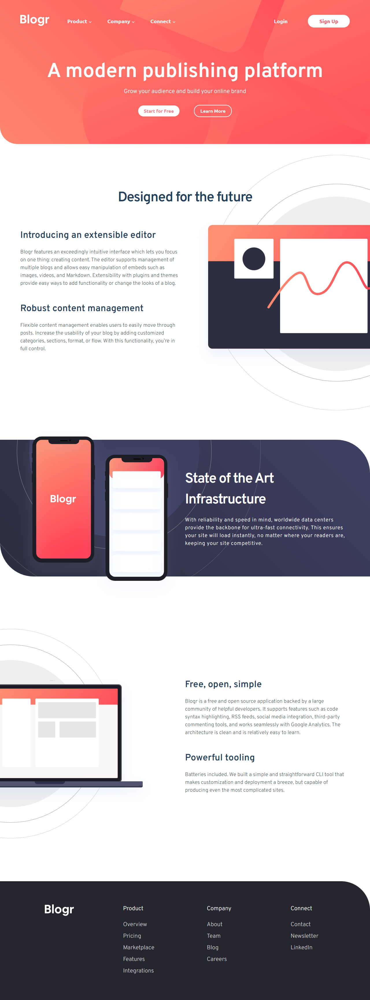

<h1 align="center">blogr landing page
</h1>

 

   <a href="https://ahlam-alsaffarini.github.io/Blogr/"> Demo 🔥🤍</a>

   Solution for a challenge from  <a href="https://www.frontendmentor.io/challenges/blogr-landing-page-EX2RLAApP"target="_blank">frontendmentor.io</a>.

 
 

## Overview

### The challenge

This challenge is to build out this landing page .

You can use any tools you like to help you complete the challenge. So if you've got something you'd like to practice, feel free to give it a go.

Your users should be able to:

- View the optimal layout for the site depending on their device's screen size
- See hover states for all interactive elements on the page

### Built with

- Semantic HTML5 markup
- CSS custom properties
- Flexbox
- Mobile-first workflow

### Useful resources

- [MDN](https://developer.mozilla.org/en-US/)
- [stackoverflow](https://stackoverflow.com/)

## Acknowledgments

this was a great challenge for me <3

A big thank you to anyone providing feedback . It definitely helps to find new ways to code and find easier solutions!
